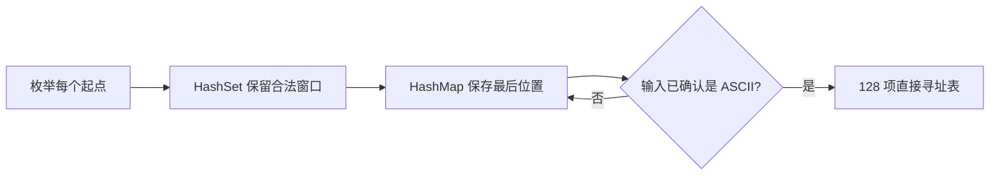

# LC 3：无重复字符的最长子串

> **定位**：本章用一道题完成“建模 → 暴力基线 → 滑动窗口 → Rust 表达 → Trace → benchmark”的闭环。前置知识：半开区间、`HashSet`、`HashMap`。适合第一次系统学习变长滑动窗口的读者。

## 为什么这道题适合作为起点

[原题](https://leetcode.com/problems/longest-substring-without-repeating-characters/)要求找出一个字符串中不含重复字符的最长连续区间长度。输入长度最多为 50,000，字符由英文字母、数字、符号和空格组成。这里不复制完整题面，只保留决定算法的两个事实：目标必须连续；字符重复是窗口是否合法的唯一约束。

“连续”意味着相邻候选区间共享绝大部分元素。若右端只向前一步，新窗口没有必要从头扫描；只要保存足够的旧状态，就能判断应该保留还是丢弃哪些字符。这正是滑动窗口能够工作的根因。

一句话抽象是：

> 在所有没有重复字符的半开区间 `[left, right)` 中，求最大的 `right - left`。

半开区间使空窗口自然表示为 `[0, 0)`，窗口长度始终是右端减左端，也避免了“两个端点是否都包含”的歧义。

## 先建立可信的暴力基线

对每个起点建立一个空集合，向右扩张到第一次重复，这个算法直接对应问题定义：

```rust
# use std::collections::HashSet;
pub fn longest_unique_substring(input: &str) -> usize {
    let chars: Vec<char> = input.chars().collect();
    let mut best = 0;

    for start in 0..chars.len() {
        let mut seen = HashSet::new();
        for &character in &chars[start..] {
            if !seen.insert(character) {
                break;
            }
            best = best.max(seen.len());
        }
    }
    best
}
```

实际源码见 [`brute_force.rs:8`](https://github.com/ZhangHanDong/ai-leetcode/blob/main/solutions/0003/src/brute_force.rs#L8)。若字符种类没有上界，最坏时间复杂度是 `O(n²)`：全不重复输入会从每个起点一路扫描到结尾。空间为 `O(min(n, U))`，`U` 是字符种类数。

不过原题字符集很小。若把 ASCII 的 `U <= 128` 视为固定常数，更精确的界是 `O(n · min(n, U))`。这解释了为什么它在某些原题输入上没有理论式看起来那么糟，也提醒我们：复杂度表达必须写清楚哪些量被当作变量。

暴力解仍然重复创建集合，也会从相邻起点反复扫描同一段字符。它的主要价值是简单、容易验证，并作为优化实现的差分测试 oracle。

### 优化线索来自哪里

设暴力解刚检查完从位置 `i` 开始的区间，又准备检查 `i + 1`。两个候选区间只有最左侧字符不同，其余部分高度重叠；重建集合等于主动丢弃已经确认过的信息。真正需要回答的问题只有两个：新加入的字符是否和当前窗口冲突，以及冲突发生时最少要丢掉多少前缀。

这给出一条可以复用的优化路径：

1. 先保存“窗口里有哪些字符”，得到 `HashSet` 窗口；
2. 再保存“字符最后出现在哪里”，把多次删除压缩成一次跳跃；
3. 若字符域固定且稠密，用数组替换哈希结构。

三次变化没有改变问题模型，只是在逐步增加状态摘要的信息量。保存的信息越多，恢复合法窗口所需的工作越少；代价是实现需要承担更强的输入前提或更多状态维护责任。



## 第一次优化：显式维护合法窗口

与其在起点变化后丢弃全部信息，不如保留当前窗口中的字符：

```rust
# use std::collections::HashSet;
# let chars: Vec<char> = "abba".chars().collect();
# let mut window = HashSet::new();
# let mut left = 0;
# let mut best = 0;
for (right, &character) in chars.iter().enumerate() {
    while window.contains(&character) {
        window.remove(&chars[left]);
        left += 1;
    }

    window.insert(character);
    best = best.max(right - left + 1);
}
```

完整实现见 [`sliding_hash_set.rs:8`](https://github.com/ZhangHanDong/ai-leetcode/blob/main/solutions/0003/src/sliding_hash_set.rs#L8)。右指针每个字符访问一次；左指针也只前进，每个字符最多被移出一次。因此虽然代码里有嵌套的 `while`，总操作次数仍是线性的，期望时间复杂度为 `O(n)`。

### 核心不变量

每次更新 `best` 时必须同时满足：

1. `window` 恰好保存区间 `[left, right]` 中的字符；
2. `window` 内没有重复字符；
3. `left` 和 `right` 都不会后退。

初始化时窗口为空，不变量成立。加入新字符后若出现重复，持续删除左端字符，直到旧副本被移出；随后加入新字符，窗口重新合法。终止时，每个可能的右端点都被处理过；当前窗口又是以该右端点结尾的最长合法窗口，所以所有候选最优值都参与过比较。

把证明拆成三步会更清楚：

- **初始化**：`left = 0`、集合为空。空区间没有重复字符，两个边界也都没有移动。
- **保持**：处理位置 `right` 的字符时，旧窗口原本合法。若新字符不在集合中，直接加入仍然合法；若已经存在，循环从左侧删除，直到删除它在窗口内的唯一旧副本。此时再加入新字符，集合与窗口重新一一对应。
- **完备性**：对固定的 `right`，循环停止时的 `left` 是在不包含重复字符前提下能够保留的最左位置；再向左就会重新包含冲突字符。因此当前窗口是所有以 `right` 结尾的合法窗口中最长的。遍历全部 `right` 后，全局最长窗口必然被记录。

这段证明还解释了为什么左右边界总移动次数是 `O(n)`。内层循环某一次可能走很多步，但每次前进都会永久排除一个左端位置；把所有外层迭代合起来，`left` 最多从 0 走到 `n`，不能把单次最坏成本简单乘上外层次数。

## 第二次优化：保存“最后位置”并直接跳跃

`HashSet` 只回答“字符是否存在”，不知道旧字符在哪里，所以左边界必须一步步移动。把状态升级为 `字符 → 最后位置` 后，可以一次跳过冲突位置：

```rust
# use std::collections::HashMap;
pub fn longest_unique_substring(input: &str) -> usize {
    let mut last_seen = HashMap::new();
    let mut left = 0;
    let mut best = 0;

    for (right, character) in input.chars().enumerate() {
        if let Some(previous) = last_seen.insert(character, right) {
            left = left.max(previous + 1);
        }
        best = best.max(right - left + 1);
    }
    best
}
```

源码见 [`last_seen_hash_map.rs:8`](https://github.com/ZhangHanDong/ai-leetcode/blob/main/solutions/0003/src/last_seen_hash_map.rs#L8)。最容易漏掉的不是哈希表，而是 `max`：旧位置可能已经落在窗口左侧。例如处理 `abba` 的最后一个 `a` 时，记录中的旧位置是 0，但当前 `left` 已经是 2；若直接赋值为 `previous + 1`，左边界会错误地退回 1。`left = max(left, previous + 1)` 同时编码了“越过窗口内重复字符”和“左边界永不后退”两个不变量。

这个实现不必从 `HashMap` 删除窗口外的旧记录。旧记录可以保留，因为 `max` 会让它失效。时间复杂度仍是期望 `O(n)`，空间为 `O(min(n, U))`，但它避免了 `HashSet` 版本的逐项删除。

从状态设计看，`HashSet` 表达的是当前窗口的精确成员，而 `HashMap` 表达的是能够重建窗口边界的历史摘要。后者可能包含窗口外的字符，却仍足以求解；算法状态不必复制现实的全部细节，只要包含决定下一步所需的最小信息。这个区别会在频次窗口、前缀状态和动态规划中反复出现。

## 第三次优化：把哈希映射换成直接寻址

如果调用方进一步确认输入是 ASCII，就可以增加一个特化路径。ASCII 字节值天然处于 `0..128`，因此可直接作为数组下标：

```rust
pub fn longest_unique_substring(input: &str) -> Option<usize> {
    if !input.is_ascii() {
        return None;
    }

    let mut last_seen_plus_one = [0_usize; 128];
    let mut left = 0;
    let mut best = 0;

    for (right, &byte) in input.as_bytes().iter().enumerate() {
        let previous_plus_one = last_seen_plus_one[usize::from(byte)];
        left = left.max(previous_plus_one);
        best = best.max(right - left + 1);
        last_seen_plus_one[usize::from(byte)] = right + 1;
    }
    Some(best)
}
```

源码见 [`last_seen_ascii.rs:6`](https://github.com/ZhangHanDong/ai-leetcode/blob/main/solutions/0003/src/last_seen_ascii.rs#L6)。表中保存“位置加一”，让 `0` 同时充当“从未出现”的哨兵；这样不需要 `[Option<usize>; 128]`。空间固定为 128 个 `usize`，查询没有哈希、冲突探测和动态扩容。

这个实现不是对 `HashMap` 的无条件替代。原题描述列出了英文字母、数字、符号和空格，但没有直接把编码写成 ASCII；因此本站的正式提交适配器使用 Unicode-safe 的 `HashMap` 版本。定长表先用 `is_ascii()` 检查额外前提，非 ASCII 输入返回 `None`。如果产品语义需要 Unicode，就应选择前一个实现，不能为了跑分快而静默改变“字符”的定义。

## Rust 字符串语义：字节、char 与用户看到的字符

Rust 的 `str` 是 UTF-8 字节序列，[标准库明确说明](https://doc.rust-lang.org/stable/std/primitive.str.html#method.len)：`str::len()` 返回字节数，而不是 `char` 数或用户感知的字素簇数。因此前三个通用实现以 `input.chars()` 产生的 Unicode 标量值计数；ASCII 特化才安全地使用 `as_bytes()`。

这仍不等于完整的自然语言“字符”。组合附加符和多码点 emoji 可能由多个 `char` 组成。原题限定的字符域让这个问题不影响提交；若把函数复用于真实文本，必须先决定业务要按字节、Unicode 标量值还是字素簇计算。

## 从代码生成动画 Trace

动画不解析 Rust 源码，而是由参考实现发出 `visit`、`window_shrink`、`window_expand` 和 `best_update` 语义事件。Trace 生成逻辑见 [`trace.rs:30`](https://github.com/ZhangHanDong/ai-leetcode/blob/main/solutions/0003/src/trace.rs#L30)，同一输入会得到确定的事件序列。

<algo-viz>
<script type="application/json">
{{#include ../../../artifacts/traces/lc-0003/last-seen-hash-map/abba.json}}
</script>
</algo-viz>

若浏览器禁用 JavaScript，可以用下面的静态步骤理解 `abba`：

| 读入位置 | 字符 | 冲突处理 | 合法窗口 | best |
|---:|:---:|---|---|---:|
| 0 | a | 无 | `[0, 1)` = `a` | 1 |
| 1 | b | 无 | `[0, 2)` = `ab` | 2 |
| 2 | b | `left: 0 → 2` | `[2, 3)` = `b` | 2 |
| 3 | a | 旧位置 0 已在窗口外，不回退 | `[2, 4)` = `ba` | 2 |

## 如何验证四个实现确实等价

固定示例只能覆盖少数路径。本项目先让四个实现共享同一组 ASCII 用例，再验证 Unicode 通用实现按 `char` 而非字节计数。最后枚举字母表 `{a,b,c,d}` 上长度 0～7 的全部 21,845 个字符串，以暴力解为 oracle 比较三个优化解。测试源码见 [`differential.rs:3`](https://github.com/ZhangHanDong/ai-leetcode/blob/main/solutions/0003/tests/differential.rs#L3) 和 [`differential.rs:49`](https://github.com/ZhangHanDong/ai-leetcode/blob/main/solutions/0003/tests/differential.rs#L49)。

穷举差分测试不能证明所有输入都正确，但它非常擅长抓 `left` 回退、空输入、连续重复和窗口边界错误；正确性证明负责覆盖无限输入空间，两者职责不同。

## 性能：复杂度相同，不代表成本相同

下面是 source revision `46b7e27` 在 Apple M1、Rust 1.98.0-nightly、Criterion 0.7.0 上的单机快照。每组 warm-up 1 秒，测量 2 秒、30 个样本；表中是中位数。原始快照见 [`apple-m1-46b7e27.json`](https://github.com/ZhangHanDong/ai-leetcode/blob/main/artifacts/benchmark-results/lc-0003/apple-m1-46b7e27.json)。绝对时间不能直接外推到其他机器。

| 数据分布 | 规模 | 暴力 | HashSet 窗口 | last-seen HashMap | ASCII 表 |
|---|---:|---:|---:|---:|---:|
| 94 字符循环 | 50,000 | 218.96 ms | 2.982 ms | 797.97 µs | 85.15 µs |
| 全为 `a` | 50,000 | 4.194 ms | 3.057 ms | 802.10 µs | 88.78 µs |
| Unicode 全唯一 | 256 | 2.619 ms | 35.03 µs | 27.20 µs | 不适用 |

数据支持三点有限结论：

1. 在本次 ASCII 数据上，直接寻址表明显减少了通用哈希结构的常数成本；这个结论以字符域固定为前提。
2. `last-seen HashMap` 比显式 `HashSet` 窗口更快，说明一次跳跃和更少的删除操作在这些数据上有效；它们的渐进复杂度仍相同。
3. 暴力解对输入分布非常敏感。全重复输入几乎立刻停止内层扫描，而循环字符输入会持续扫描到字符集上界。只报告其中一组会造成误导。

本轮没有测峰值内存和分配次数，因此不能从这张表声称某实现“实测更省内存”；这里只能依据数据结构给出空间上界。

还需要注意两个看似矛盾、实际来自不同层次的事实。第一，`HashSet`、`HashMap` 和 ASCII 表在原题模型下都可写成期望 `O(n)`；第二，它们在 50,000 字符循环输入上的中位数相差约 35 倍。大 O 只描述规模增长趋势，不会消除哈希计算、动态分配、缓存局部性和每个元素执行几次更新等常数成本。

反过来，不能把这次约 35 倍写成永久规律。它依赖 Apple M1、当前 Rust 工具链、默认哈希器和特定字符分布。可靠的表达是：“在记录的这次实验和输入上，ASCII 表为 85.15 µs，`HashSet` 为 2.982 ms”；不可靠的表达是：“数组永远比集合快 35 倍”。前者能够被复现和推翻，后者把一次测量误写成普遍定律。

## 可运行的 Rust 版本

下面的代码块可以在 mdBook 中编辑并发送到 Rust Playground。它使用 Unicode `char` 语义，适合观察 `max` 对左边界的保护作用。

```rust,editable
use std::collections::HashMap;

fn longest_unique_substring(input: &str) -> usize {
    let mut last_seen = HashMap::new();
    let mut left = 0;
    let mut best = 0;

    for (right, character) in input.chars().enumerate() {
        if let Some(previous) = last_seen.insert(character, right) {
            left = left.max(previous + 1);
        }
        best = best.max(right - left + 1);
    }
    best
}

fn main() {
    assert_eq!(longest_unique_substring("abba"), 2);
    assert_eq!(longest_unique_substring("你好吗你"), 3);
    println!("all checks passed");
}
```

## 用户能做什么

完成这一章后，不应只记住一份代码。可以按下面顺序重新推导：

1. 先写出半开窗口以及“更新答案时窗口无重复”的不变量；
2. 只用 `HashSet` 实现逐步收缩，确认左右边界都不回退；
3. 问自己需要增加什么信息，才能知道左边界应直接跳到哪里；
4. 删除 `max`，用 `abba` 手工走一遍，观察旧记录怎样让边界错误回退；
5. 把输入换成 `你好吗你`，解释为什么 `str::len()` 不能作为答案；
6. 最后再根据输入域决定是否允许 ASCII 定长表，而不是默认选择跑分最快的实现。

进一步的验证练习是把穷举字母表从 4 个字符扩大到 5 个，或提高最大长度，并观察测试数量如何指数增长；这能同时说明差分测试的力量和边界。性能练习则应修改字符分布，而不仅是扩大 `n`，然后检查结论是否仍成立。

## 失效边界与迁移

这套窗口成立需要两个前提：目标是连续区间；窗口违反约束后，左边界向右移动能够单调地恢复合法性。若题目允许任意删除形成子序列，窗口就不再描述完整选择空间。若数组包含负数并以“区间和达到阈值”为合法条件，收缩方向也未必保持单调。

从 LC 3 迁移到后续题目时，保留“扩张 → 恢复合法 → 更新答案”的骨架，只替换窗口摘要和合法条件：

| 题目 | 保留的骨架 | 新增状态或条件 |
|---|---|---|
| LC 567 字符串的排列 | 固定连续窗口 | 目标频次与匹配数 |
| LC 438 找到字符串中所有字母异位词 | 固定连续窗口 | 收集全部合法起点 |
| LC 76 最小覆盖子串 | 扩张与收缩 | 从“无重复”改为“覆盖目标频次” |
| LC 209 长度最小的子数组 | 变长窗口 | 合法性依赖正数带来的区间和单调性 |
