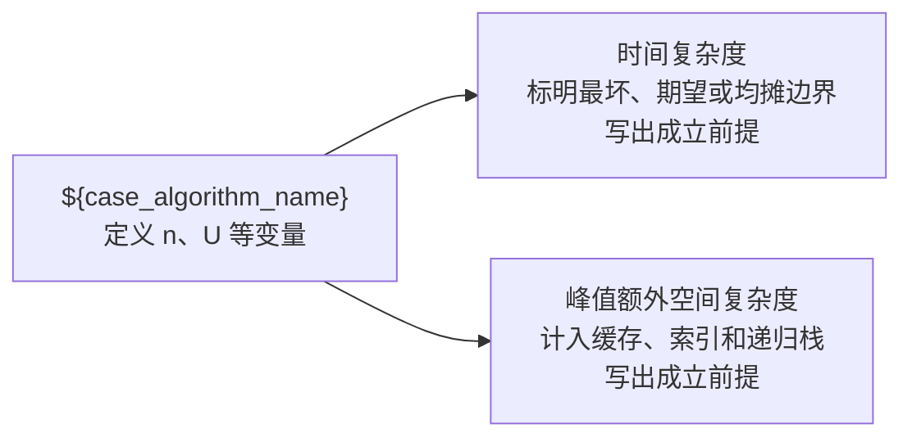

# ${pattern_name}

> **定位**：${positioning}。前置章节：${prerequisites}。

## 为什么需要这个模式

## 识别信号与前提

## 状态、不变量和转移

## 案例一：基础形态

## 案例二：约束变化

## 案例三：反例或边界

若案例中引入独立算法，必须紧随该算法提供 Mermaid 复杂度图，同时展示时间复杂度、峰值额外空间复杂度、变量定义、边界类型和成立前提。

## 通用代码骨架

## 失效条件与替代方案

## 关系图与迁移练习
