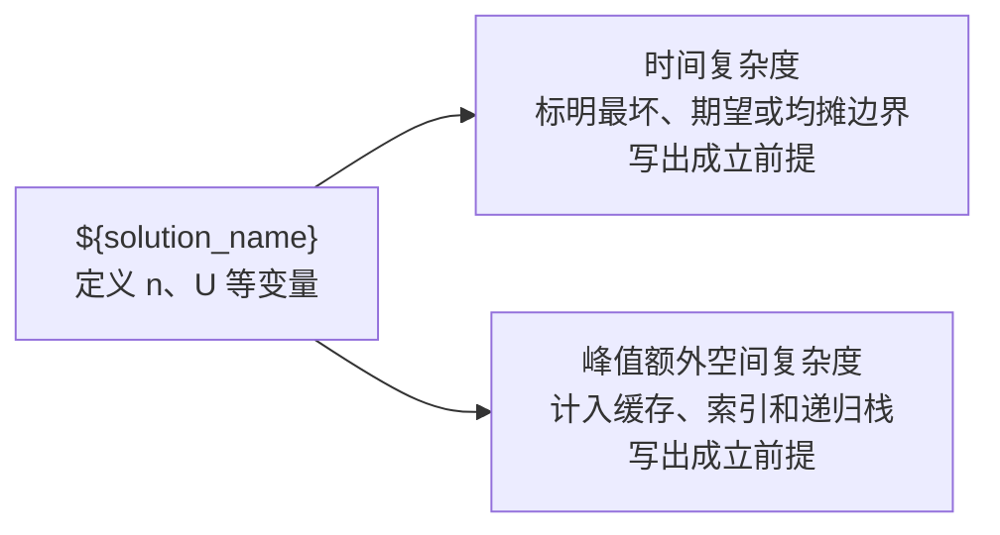

# ${problem_title}

> **定位**：${positioning}。前置模式：${prerequisites}。

## 一句话抽象

## 约束与模型

## 暴力基线

## 状态与不变量

## 解法推导

每一种算法都使用独立小节，并在实现与推导后加入复杂度图：

### ${solution_name}

#### 复杂度图示

## 正确性证明

## 代码与运行

<algo-lab problem="${problem_id}" solution="${solution_id}"></algo-lab>

## 动画

<algo-viz trace="${trace_path}"></algo-viz>

## 性能与工程取舍

## 失效边界

## 相似题与迁移练习
