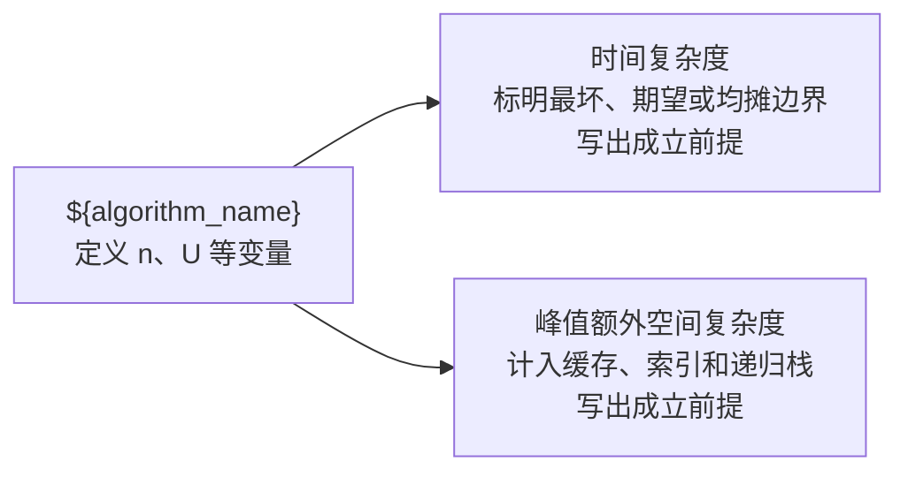

# ${structure_name}

> **定位**：${positioning}。前置章节：${prerequisites}。

## 抽象模型

## 操作与复杂度

## 内部不变量

## 实现比较

## 动态过程

## 典型算法模式

本节每引入一种算法，都必须紧随其后提供 Mermaid 复杂度图：

```mermaid
flowchart LR
    A["${algorithm_name}<br/>定义 n、U 等变量"]
    A --> T["时间复杂度<br/>标明最坏、期望或均摊边界<br/>写出成立前提"]
    A --> S["峰值额外空间复杂度<br/>计入缓存、索引和递归栈<br/>写出成立前提"]
```

## 不适用场景
